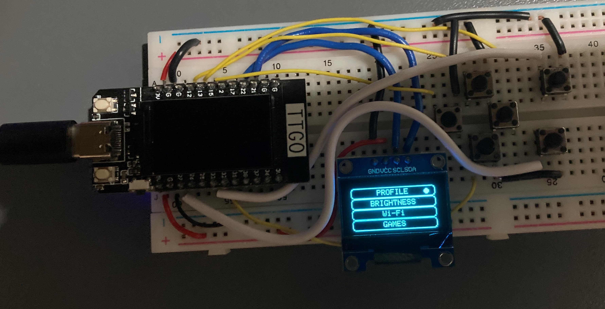

# Introduction to Playard Game Engine

# What is Playard?

It is an open-source educational project that aims to impose today's technologies on people in a fun way and they can be involved in the development of the project.

# What Have We Done So Far ?
We wanted to develop the idea of ​​a retro game console made abroad using a microcontroller. We started working on it. We set our microcontroller as **ESP32**. We worked on the coding. We also stored and shared the codes we wrote on GitHub. With new research and brainstorming, we reached a solution for every problem that came our way. We wanted to develop our project in line with the events we participated in and the information we gained, and we brought up our idea of ​​IoT (Internet of Things). Our game console can connect to the wireless network and we get the data used in the game over the internet, eliminating the memory problem. Another innovation that we do not have in other projects is that we have created a design window on our website where we can easily design a game. All our users will be able to design the images of their own games using this system.
