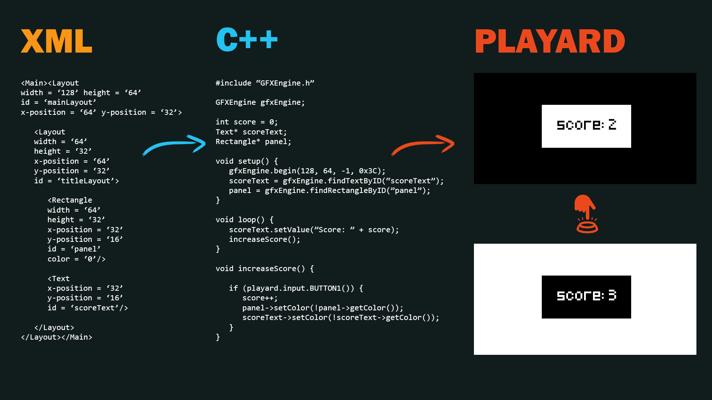

# Why Use Playard Game Engine?

Playard Game Engine is created based on idea for seperating graphic design and programming processes for provide a more abstract programming experience. With its built-in XML based graphic engine it is more easier to work on graphics. Thus, it reduces development and test durations and increases the productivity.

