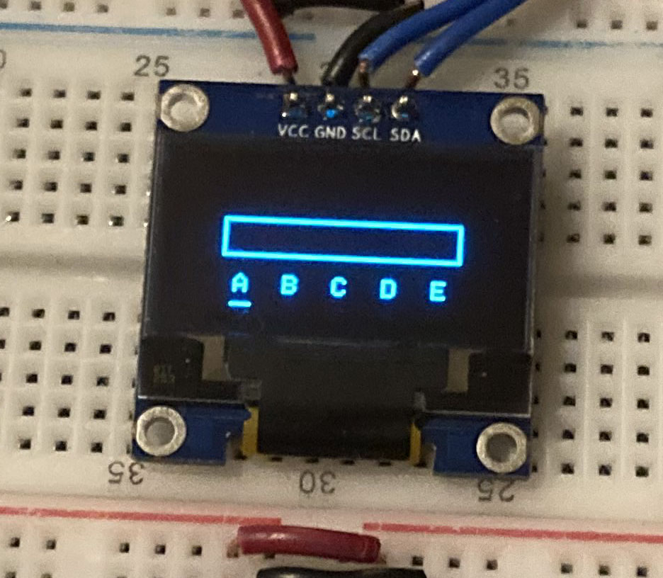

After all boring animations now we can get input from player. PGE has built-in input module. We must get instance from Input class and call its begin functions to apply configurations.

```cpp
Input input;

void setup () {
  input.begin();
}
```

### Buttons

An input object have many functions for each button that returns 1 when pressed.

```cpp
input.BUTTON_1();
input.BUTTON_2();
input.BUTTON_3();
input.BUTTON_U();
input.BUTTON_R();
input.BUTTON_D();
input.BUTTON_L();
```

### Built-in Keyboard Module

